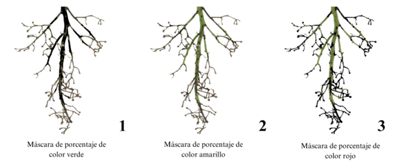
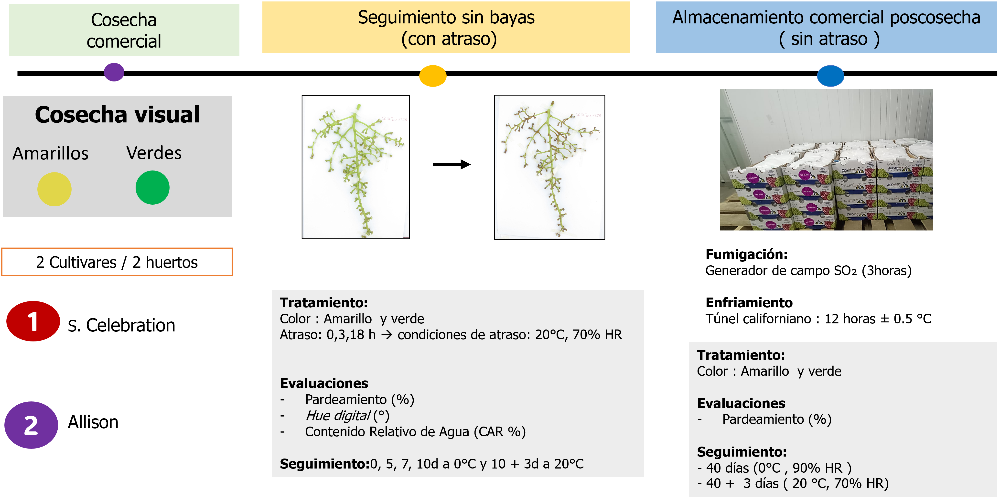

# Sensibilidad del raquis de uva de mesa a la deshidratación en función de factores de precosecha.

Este repositorio contiene el código, las bases de datos y los documentos asociados al proyecto de investigación titulado “Determinación de la sensibilidad del raquis a la deshidratación en postcosecha basada en parámetros de cosecha”, desarrollado en el marco de estudios avanzados en fisiología vegetal y poscosecha de uva de mesa (Vitis vinifera L.).



## Hipotesis 

La sensibilidad del raquis a la deshidratación en poscosecha estaría determinada por características presentes al momento de la cosecha, por lo que es posible diagnosticar dicha sensibilidad mediante indicadores específicos del tejido.


## Objetivo 

Determinar la sensibilidad del raquis de uva de mesa a la deshidratación en poscosecha a través de los cambios que ocurren en el color y contenido relativo de agua del raquis en la cosecha.


## Audiencia
Este repositorio está dirigido a estudiantes, investigadores y profesionales con interés en:

- La evaluación digital del color y la sensibilidad al pardeamiento del raquis en uva de mesa mediante análisis RGB–CIELAB.
- El desarrollo de modelos predictivos para cuantificar el riesgo de deshidratación y deterioro del raquis a partir de parámetros medidos en precosecha.
- El uso de Python para la automatización, visualización y análisis de datos provenientes de huertos comerciales y ensayos experimentales.


## 🗺️ Estructura del proyecto
El repositorio cuenta con dos carpetas principales: Datos y Scripts


``` text
uva-de-mesa-2025/
├── README.md
├── LICENSE
├── .gitignore
├── .nojekyll
│
├── datos/
│   ├── Almacenamiento comercial.csv
│   ├── Base de datos.xlsx
│   ├── caracterizacion inicial.xlsx
│   ├── Contenido relativo de agua.csv
│   ├── Cosecha.csv
│   └── Pardeamiento uva de mesa.csv
│
├── Figuras/
│   ├── Coloracion de raquis.png
│   ├── Mascara_porcentaje.png
│   └── Metodologia_Experimental.png
│
├── scripts/
│   ├── pardeamiento_uva.ipynb
│   ├── pardeamiento_uva.qmd
│   └── pardeamiento_uva.pdf

```

### Metodología resumida

Material vegetal: Racimos de Vitis vinifera L. (‘Allison’, ‘Sweet Celebration’) provenientes de huertos comerciales en la zona central de Chile.



## Agradecimientos
Esta investigación se realizo en el laboratio de poscosecha UC y PRONABEC - Beca generación bicentenario.